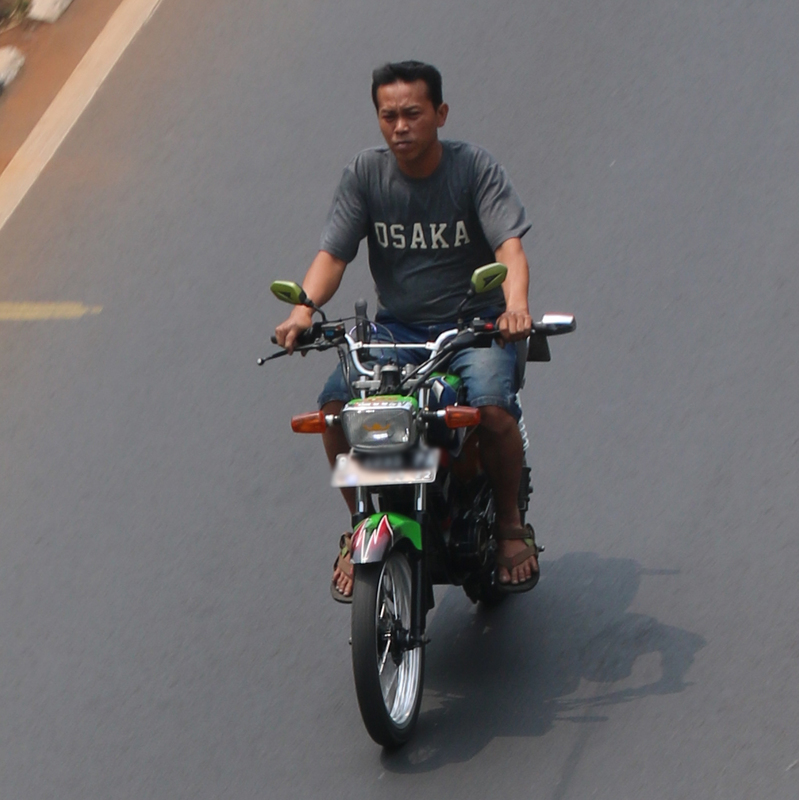
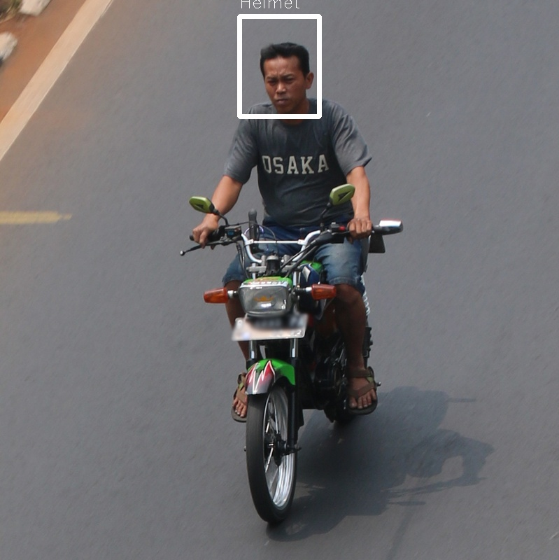
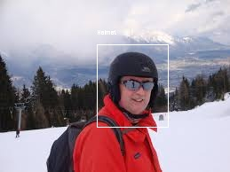
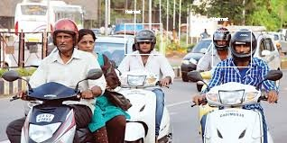
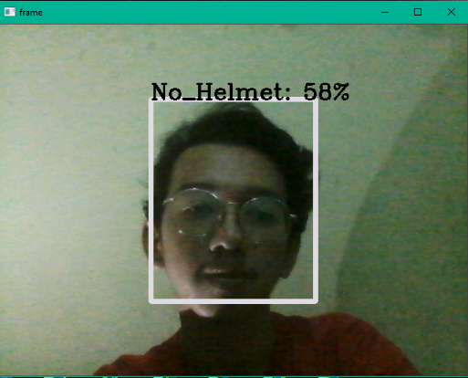
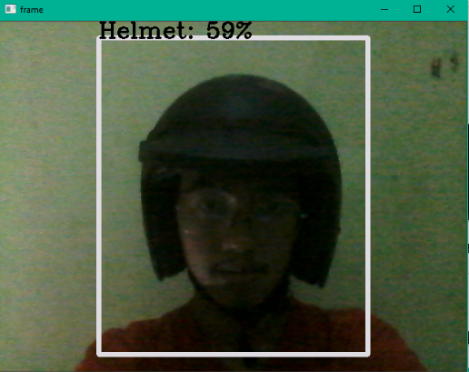

### Sistem Deteksi Helm menggunakan Yolo

***
**Nama  : Hisyam Zulkarnain F\
NRP   : 05311840000019**

***
## Pengenalan

Deteksi dan klasifikasi objek secara real-time. Pada project ini saya menggunakan pendeteksi helm yang dimana project ini dapat diterapkan untuk sistem lalu lintas contohnya pada penggunaan CCTV. 


## Dependensi

Python3, tensorflow 2.4.0, numpy, opencv 3.


### Mulai

Anda dapat memilih salah satu dari tiga cara berikut untuk memulai darkflow.

1. Cukup buat ekstensi Cython di tempatnya. CATATAN: Jika menginstal dengan cara ini, Anda harus menggunakan `./flow` direktori kloning darkflow, bukan `flow` karena darkflow tidak diinstal secara global.
    ```
    python3 setup.py build_ext --inplace
    ```

2. Let pip install darkflow globally in dev mode (still globally accessible, but changes to the code immediately take effect)
    ```
    pip install -e .
    ```

3. Install with pip globally
    ```
    pip install .
    ```


## Code progrram
Install paket-paket yang dibutuhkan yaitu opencv-python. Beberapa yang perlu diimport adalah sebagai berikut

```
import cv2
from darkflow.net.build import TFNet
import numpy as np
import time
```
Load file configurasi dan bin dataset model dari folder kita.
```
options = {
    'model': 'cfg/yolov2-tiny.cfg',
    'load': 'bin/yolov2-tiny_3000.weights',
    'threshold': 0.1,
    }
```
Memasukan data load ke tfnet kemudian men-set untuk video capture menggunakan openCV .
```
tfnet = TFNet(options)
colors = [tuple(255 * np.random.rand(3)) for _ in range(10)]

capture = cv2.VideoCapture(0)
capture.set(cv2.CAP_PROP_FRAME_WIDTH, 1920)
capture.set(cv2.CAP_PROP_FRAME_HEIGHT, 1080)
```
Setelah load dimasukkan kemudian mengambil data waktu untuk digunakan untuk mem-print frame per seconds pada nantinya. dan membuat file JSON untuk output yang berisikan data dari titik koordinat tiap pixel. 
```
while True:
    stime = time.time()
    ret, frame = capture.read()
    if ret:
        results = tfnet.return_predict(frame)
        for color, result in zip(colors, results):
            tl = (result['topleft']['x'], result['topleft']['y'])
            br = (result['bottomright']['x'], result['bottomright']['y'])
            label = result['label']
            confidence = result['confidence']
            text = '{}: {:.0f}%'.format(label, confidence * 100)
            frame = cv2.rectangle(frame, tl, br, color, 5)
            frame = cv2.putText(
                frame, text, tl, cv2.FONT_HERSHEY_COMPLEX, 1, (0, 0, 0), 2)
        cv2.imshow('frame', frame)
        print('FPS {:.1f}'.format(1 / (time.time() - stime)))
    if cv2.waitKey(1) & 0xFF == ord('q'):
        break
```
Mengakhiri video frame openCV.
```
capture.release()
cv2.destroyAllWindows()
```

## Hasilnya

Menjalankan menggunakan flow

``
python flow --imgdir input/ --model cfg/yolov2-tiny.cfg --load bin/yolov2-tiny_3000.weights --gpu 1.0
``

Menjalankan menggunakan flow dengan ouput file `JSON`

``
python flow --imgdir input/ --model cfg/yolov2-tiny.cfg --load bin/yolov2-tiny_3000.weights --gpu 1.0 --json
``

**Input**

Terletak pada folder `input`





**Output**

Terletak pada folder `input/out`






**Output JSON**

Terletak pada folder `input/out`

```
[{"label": "Helmet", "confidence": 1.0, "topleft": {"x": 162, "y": 58}, "bottomright": {"x": 272, "y": 225}}]
[{"label": "Helmet", "confidence": 0.85, "topleft": {"x": 342, "y": 23}, "bottomright": {"x": 456, "y": 166}}]
[{"label": "Helmet", "confidence": 0.98, "topleft": {"x": 109, "y": 50}, "bottomright": {"x": 189, "y": 143}}]
```

## Live Webcam secara real time

Menjalankan webcam menggunakan `video.py`



Jika saya memakai helm


